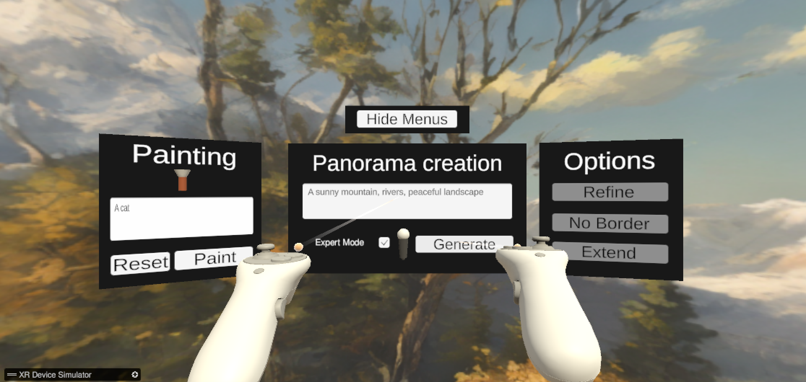

# Speech-to-world, Unity client

Speech-to-world is a generative AI solution to generate video game worlds from a single prompt.
This is a VR client for Unity.
You can use it for generating, modifying and exploring generated environments.



It features two main scenes, one for desktop and one for virtual reality, that both let you explore new worlds.
The idea of this project is to let  you access all the AI features from an application, reducing the interruptions in the creation process.

[Short complete demo.webm](https://github.com/user-attachments/assets/b8a97c92-ae75-4732-95af-c4fb64345bb0)

## Installation

> [!Important]
> This is only the client,
you need a running server to actually use the AI features!
The repository to run the server can be found at: [VR-Environment-GenAI-Server](https://github.com/fcbg-hnp-vr/VR-Environment-GenAI-Server).

The installation is simple, as we use standard Unity features.

1. Download Unity Editor 2022.3.36+.
2. Open the project and you should be able to navigating in all scenes, but the AI features are not activated yet.

Most VR headsets compatible with OpenXR should work out of the box.

If the XR assets do not work, you can try to reinstall them from the [Package Manager](https://docs.unity3d.com/Manual/Packages.html) (Package manager → XR Interaction Toolkit → Samples → Starter Assets → Reimport).

For Windows Mixed Reality Headsets, you may need the MRTK plugins.

## Usage

This Unity project features a scene generated by an AI from a text prompt.
The scene is dynamically created based on the input text and allows for unique and creative environments to be generated.

To generate a scene:

1. Start the Python server, and edit the [configuration](#configuration) if necessary.
2. Load the desired scene. On desktop load the "Desktop Creator" scene, and the "VR Creator" scene in VR.
3. Enter a text prompt in the input field. In VR you can speak while holding the microphone.
4. Press the "Generate" button.
5. Watch as the AI creates a scene based on your text prompt. A progress bar indicates the remaining time.

## Configuration

You may need to set a few configuration parameters for a smooth experience.
Most configuration parameters are under `Assets/Configurations/api.json`.

In case you are running the project locally VR and AI on the same computer (the "debug" configuration), you should set the following.

- `pythonFallbackApiFile`: file path to the Python ``api.json`` file, this file should be in the root folder of the Python project.

If you want to connect to a remote server, the important features to set:

- `serverDefaultIp`: the IP to reach the AI server (IPv4 preferred).
- `serverDefaultPort`: server default port number.

> **Note:** if both the server and the fallback api file are correctly specified, the server will be ignored and the connection will be local. You can replace the fallback api file path by any wrong path to prevent this behavior.

Some options are considered legacy and where used for communication on the same file storage.
You can specify where Python should save the files, temporary locations are better.

- `audioPath`: the path to the temporary audio file to save when using the speech-to-text feature.
- `baseImage`: the path to the texture *that will be modified*.
- `maskPath`: the path to the temporary mask texture that is used during the inpainting feature.

## Features

The main features of this project are:

- Text-to-skybox generation.
- Speech-to-text: speak naturally.
- Mask drawing and inpainting: freely select and redraw elements.

## Scenes

All the following scenes are in the ``Assets/Scenes`` folder.

- "Desktop Creator" - Main scene for skybox creation in desktop mode.
- "VR Creator" - Skybox creation with a VR headset. You can also use it when no headset is plugged in, but this is much of a debug feature.
- "Speech Recognition" - A simple scene that only integrates speech-to-text, for testing purposes.

## Documentation

We provide an [online documentation](https://fcbg-hnp-vr.github.io/VR-Environment-GenAI-Unity/), you can also access it in the `docs/` folder.

The documentation is generated with DocFX, you can regenerate it with [DocFX](https://github.com/dotnet/docfx).

```bash
cp README.md Documentation/index.md
docfx Documentation/docfx.json
```

It will generate a documentation under `docs/`.

A local documentation can also be generated with ``docfx Documentation/docfx.json -t statictoc,custom_template``.

## Future developments

The short term goal is to implement more features from the server, such as the terrain generation.
The rest depends on the popularity of the package, I'm open to pull requests.

## Links

You can also find the project at the following locations :

- Official public repository: <https://github.com/fcbg-hnp-vr/VR-Environment-GenAI-Unity>. This repository may not be maintained.
- For the official public AI server: <https://github.com/fcbg-hnp-vr/VR-Environment-GenAI-Server>.

The project was initially developed at the [Fondation Campus Biotech Geneva](https://fcbg.ch/) ([GitHub](https://github.com/fcbg-hnp-vr/)),
in collaboration with the [Laboratory of Cognitive Science](https://www.epfl.ch/labs/lnco/) (part of [EPLF](https://epfl.ch)).
